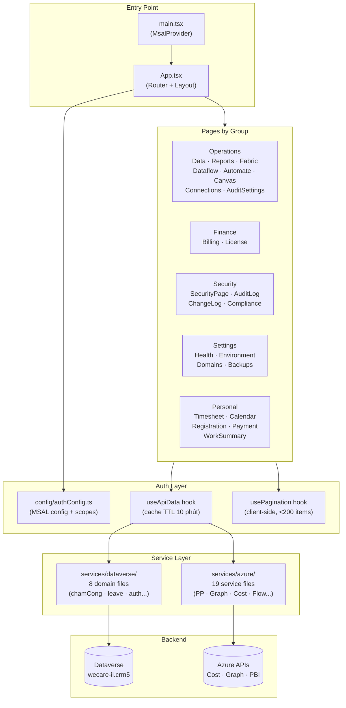

# WorkHub

**Last Updated**: 2026-06-24 11:00
> Internal web app quản lý hệ thống, chấm công, nghỉ phép và tools nội bộ — kết nối Dataverse qua MSAL Azure AD.

---

## 1. Current Status & Next Steps
- **Trạng thái hiện tại**: Đang ở phase hoạt động phát triển tích cực (Active Development). Tập trung vào việc triển khai phần Security & Compliance và chuẩn bị cho việc tích hợp API thực tế thay thế các placeholders.
- [ ] **SignIn Log page** — implement Azure AD Sign-in logs (MS Graph `auditLogs/signIns`)
- [ ] **AutomateFlowPage** — kiểm tra filter UI align DESIGN.md không (38KB)
- [ ] **ManagementView.tsx** — 19KB, review design pattern alignment
- [ ] **Incidents & Compliance pages** — xác định API source và implement
- [ ] **ChangeLog page** — integrate GitHub API (`/orgs/WCG-HieuLe/repos` releases)
- [ ] **Audit `index.css`** — tìm và xóa các class dead code (cleanup, low risk)
- [ ] **`styles/features/`** — bắt đầu migrate CSS theo feature module (sau milestone stable)
- [ ] **Build production** — chạy `yarn build` và verify không có TypeScript error

---

## 2. Tiến độ (Features / Deliverables)
- [x] **Services refactor** — Hoàn tất phân rã `services/dataverse/` thành 8 domain files và `services/azure/` thành 19 service files chuyên biệt.
- [x] **UI/UX Audit & Standardization** — Viết tài liệu `docs/DESIGN.md` và sửa toàn bộ font violations (px -> rem), đồng bộ hóa root container `health-page`.
- [x] **Personal section** — Hoàn thành các tính năng cá nhân như DayDetail, NotificationPanel, LeaveDetailModal, LeaveStats, LeaveList, Registration, Payment.
- [x] **Core Hooks & caching** — Implement hook `useApiData.ts` (Pattern A - cache TTL 10m) và `usePagination.ts` (Pattern C - client side).
- [🔄] **Security & Operations Section** — Đang làm việc với các trang thuộc nhóm Security (SignInLog, ChangeLog, Incidents, Compliance) để hoàn tất tích hợp API.
- [ ] **Dataflow Page Refactor** — Tối ưu hóa file `DataflowPage.tsx` hiện tại đang quá lớn (60KB).

---

## 3. Architecture & Cấu trúc (Overview)
> 💡 Navigation chi tiết nằm trong [index.md](./index.md). Lịch sử cập nhật kiến thức nằm trong [log.md](./log.md).

```text
WorkHub/
├── docs/             ← Tài liệu thiết kế & UI guidelines (DESIGN.md)
├── src/              ← Mã nguồn React + TypeScript
│   ├── components/   ← React UI components
│   ├── services/     ← Tích hợp Azure & Dataverse APIs
│   └── hooks/        ← custom hooks (useApiData, usePagination)
└── index.md          ← Clickable Navigation Map (OKF)
```

### Architecture Diagram

*Kiến trúc 3 lớp: Pages → useApiData/usePagination hooks → Service layer → APIs. Services tách thành 2 domain rõ ràng (azure/ + dataverse/).*

---

## 4. Quyết Định & Insight (Decisions)

### Các Quyết định thiết kế
- **Dùng `useApiData` thay vì useState + useEffect**: Tích hợp cache TTL 10 phút, tránh re-fetch dư thừa khi người dùng switch tab, giúp đồng nhất cơ chế xử lý lỗi.
- **Thêm `usePagination` hook riêng**: Tách biệt client-side pagination (< 200 items) khỏi Pattern B (server-side cursor) giúp tái sử dụng code tốt hơn.
- **Giữ `index.css` nguyên khối khi phát triển**: Hạn chế split CSS trong lúc đang code dồn dập nhằm giảm rủi ro break layout. Đã tạo sẵn slot `styles/features/` để chuyển đổi sau milestone stable.
- **Không dùng Tailwind cho layout chính**: Hệ thống layout và glassmorphism sử dụng thuần CSS custom properties để xử lý dark theme linh hoạt.
- **Pattern B (Cursor Pagination) cho LogsPage**: Audit logs có thể vượt quá 100k bản ghi, cursor pagination là phương án duy nhất khả thi để đảm bảo hiệu năng.
- **Recharts cho Charts**: Sử dụng Recharts do tính năng React-native tốt, ít boilerplate, đáp ứng đầy đủ yêu cầu của dashboard chi phí.
- **Dùng `rem` thay vì `px` cho font**: Tôn trọng cấu hình cỡ chữ của trình duyệt người dùng và chuẩn hóa theo `docs/DESIGN.md`.
- **Tách services thành các domain file nhỏ**: Tránh việc dồn dịch vụ Dataverse vào một file khổng lồ, tăng khả năng bảo trì và tối ưu hóa tree-shaking.
- **MSAL `loginRedirect` thay vì `loginPopup`**: Tránh việc popup bị chặn bởi các trình duyệt hiện đại, đảm bảo luồng đăng nhập mượt mà và tin cậy hơn.

### Known Issues & Negative Decisions
- **`index.css` nguyên khối (~183KB)**: Khó bảo trì nhưng được giữ lại để split sau.
- **Recharts tooltip `fontSize: '11px'`**: Buộc phải inline do giới hạn cấu hình của thư viện Recharts, được chấp nhận là ngoại lệ hợp lệ.
- **Zustand ít được sử dụng**: Phần lớn state là local `useState`. Đây là quyết định có chủ ý vì ứng dụng không có nhiều state toàn cục phức tạp cần chia sẻ chéo.
- **Các trang Security chưa có API**: Hiện là placeholders (SignInLog, Incidents, Compliance, ChangeLog) do chưa chốt nguồn API cuối cùng.
- **`DataflowPage.tsx` quá lớn (~60KB)**: Gom nhiều logic (tabs, lịch sử, lịch trình) - cần refactor sau khi hệ thống ổn định.

---

## 5. Specific Context (Dynamic Sections)

### Tech Stack & Commands
- **Core Stack**: Vite 5, React 18, TypeScript 5.3 (strict mode), CSS Custom Properties (Dark theme/Glassmorphism), Lucide React, MSAL Browser/React, Recharts, Zustand, React Router DOM 7, xlsx-js-style.
- **Commands**:
  ```bash
  yarn dev            # Vite dev server (port 5173)
  yarn build          # Biên dịch TypeScript & build code -> dist/
  yarn preview        # Preview built output locally
  npx tsc --noEmit    # Type check TypeScript
  ```

### Environment Variables
| Variable | Required | Mô tả |
|----------|----------|--------|
| `VITE_CLIENT_ID` | ✅ | Azure AD App Registration Client ID |
| `VITE_AUTHORITY` | ❌ | Authority URL (default: `https://login.microsoftonline.com/common`) |
| `VITE_DATAVERSE_URL` | ✅ | Dataverse base URL |
| `VITE_DATAVERSE_ORG_URL` | ✅ | Dataverse org URL |
| `VITE_DATAVERSE_SCOPE` | ✅ | Dataverse OAuth scope |
| `VITE_AZURE_SUBSCRIPTION_ID` | ✅ | Azure subscription ID (cho Billing/Cost) |
| `VITE_PP_ENV_ID` | ✅ | Power Platform Environment ID |
| `VITE_TENANT_ID` | ✅ | Azure AD Tenant ID |
| `VITE_EMPLOYEE_ID` | ❌ | Default employee GUID cho dev |

---

## 6. Authentication Details
- **SSO Flow**: Tự động chuyển hướng đăng nhập (`loginRedirect`) qua Azure AD khi chưa xác thực.
- **Scopes**: Sử dụng scope mặc định của Dataverse `https://wecare-ii.crm5.dynamics.com/.default`. Các dịch vụ nâng cao (Power BI, Graph, Power Platform Admin) yêu cầu token riêng bằng `acquireTokenSilent` / `acquireTokenRedirect`.
- **User Mapping**: Login -> Lấy `localAccountId` -> Tìm `systemuser` tương ứng -> Map sang bảng `crdfd_employee` để xác định `employeeId` (GUID) thực thi chấm công/phép.
