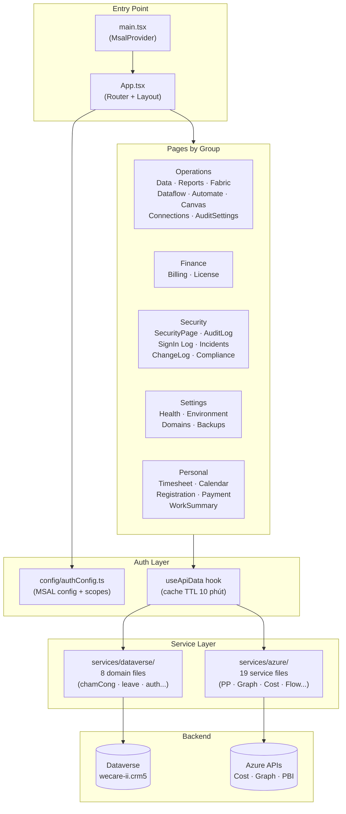

# WorkHub

**Last Updated**: 2026-06-08 11:53
**Last Reviewed**: 2026-06-08 11:53

> Internal web app quản lý hệ thống, chấm công, nghỉ phép và tools nội bộ — kết nối Dataverse qua MSAL Azure AD.

---

## Tech Stack

| Layer | Tech |
|-------|------|
| Framework | Vite 5 + React 18 |
| Language | TypeScript 5.3 (strict mode) |
| Styling | CSS custom properties (theme engine) + glassmorphism (`index.css` ~183KB) |
| Icons | `lucide-react` ^0.562 |
| Auth | `@azure/msal-browser` ^4.27 + `@azure/msal-react` ^3.0.23 |
| Data Source | Dataverse API (`wecare-ii.crm5.dynamics.com/api/data/v9.2`) |
| Charts | `recharts` ^3.8 |
| State | `zustand` (global) + `useState` (component-level) |
| Server State | `useApiData` hook (central fetch + cache engine) |
| Notifications | `sonner` ^2.0.7 (toast) |
| Routing | `react-router-dom` ^7.13 |
| Virtualization | `@tanstack/react-virtual` ^3.13 |
| Excel | `xlsx-js-style` ^1.2 |
| Deploy | GitHub Pages (`base: /WorkHub/`) |

---

## Build Commands

```bash
yarn dev            # Vite dev server (port 5173)
yarn build          # tsc && vite build → dist/
yarn preview        # Preview built output locally
npx tsc --noEmit    # Type check only (không emit file)
```

---

## Environment Variables

| Variable | Required | Mô tả |
|----------|----------|--------|
| `VITE_CLIENT_ID` | ✅ | Azure AD App Registration Client ID |
| `VITE_AUTHORITY` | ❌ | Authority URL (default: `https://login.microsoftonline.com/common`) |
| `VITE_DATAVERSE_URL` | ✅ | Dataverse base URL |
| `VITE_DATAVERSE_ORG_URL` | ✅ | Dataverse org URL |
| `VITE_DATAVERSE_SCOPE` | ✅ | Dataverse OAuth scope |
| `VITE_AZURE_SUBSCRIPTION_ID` | ✅ | Azure subscription ID (cho Billing/Cost) |
| `VITE_PP_ENV_ID` | ✅ | Power Platform Environment ID |
| `VITE_TENANT_ID` | ✅ | Azure AD Tenant ID |
| `VITE_EMPLOYEE_ID` | ❌ | Default employee GUID cho dev |

> Xem `.env.example` để có đủ danh sách. **Không** commit `.env`.

---

## Authentication

- **Method**: MSAL popup login → Azure AD
- **Scopes chính**: `https://wecare-ii.crm5.dynamics.com/.default`
- **Multi-scope**: Power BI, Power Platform Admin, MS Graph (mỗi scope dùng `acquireToken()` riêng)
- **Cache**: `sessionStorage`
- **Flow**: Login → `localAccountId` → `systemuser` → `crdfd_employee` → `employeeId` (GUID)

---

## Architecture Diagram

> Lấy từ source code thực tế — routes, modules, data flow.



*Kiến trúc 3 lớp: Pages → useApiData hook → Service layer → APIs. Services đã refactor thành 2 domain rõ ràng.*

---

## Project Structure

```
src/
├── App.tsx                   # Root layout + routing (15KB)
├── main.tsx                  # Entry point — MsalProvider wrapper
├── index.css                 # Toàn bộ styling (~183KB — nguyên khối)
├── components/               # Page components (31 files)
│   ├── ui/                   # Atomic components (Button, ConfirmDialog...)
│   └── flow/                 # AutomateFlow sub-components
├── hooks/
│   └── useApiData.ts         # Central fetch engine + cache (TTL 10 phút)
├── services/
│   ├── azure/                # 19 service files: PP, Graph, Cost, Flow analytics...
│   └── dataverse/            # 8 domain files: authService, chamCongService,
│                             #   dnttService, notificationService, registrationService...
├── config/                   # authConfig.ts — MSAL + scope configs
├── routes/                   # index.ts — Route constants + ROUTE_META
├── types/                    # TypeScript interfaces
├── context/                  # React Context providers
├── lib/                      # dateUtils.ts
├── styles/features/          # (đang trống — chuẩn bị CSS split)
├── constants/, data/, utils/
docs/
└── DESIGN.md                 # Design pattern chuẩn cho toàn bộ pages
```

---

## Features

### ✅ Dashboard
- Welcome greeting (dynamic từ MSAL) + date
- Stats grid (4 cards): Admin Systems, Active Tools, Pending Requests, This Month
- Quick Access links (6 portal cards): Power Platform, Azure, Google Admin, MS Entra, SharePoint, 365 Admin
- Design: glassmorphism stat-card + hover-glow

### ✅ Operations

| Page | Mô tả | API |
|------|--------|-----|
| **DataPage** | Database & storage: Portals, Dataverse tables, Fabric tabs | Dataverse metadata |
| **ReportsPage** | Power BI gallery: search, gradient thumbnails, iframe embed | Power BI REST |
| **FabricPage** | Microsoft Fabric — Workspace, items (Dataflow, Dataset, Report, Lakehouse) | Power BI API |
| **DataflowPage** | Power Apps + Fabric dataflows — status, history, delete, schedule | PA Dataverse + PBI API |
| **AutomateFlowPage** | Power Automate flow list — Lightweight Health Check (~700 flows, ~20s) + flow analytics | Flow API + flowAnalyticsService |
| **CanvasAppPage** | Canvas Apps list + status + delete | Power Apps API |
| **ConnectionsPage** | Power Platform Connections — grouped by connector, status, delete | Power Apps API |
| **AuditSettingsPage** | Dataverse Audit configuration — bật/tắt audit per table/column | Dataverse Metadata API |

### ✅ Dev Tools
- Portal links: Stitch, GitHub, Figma, NPM, Project-Tracker
- PP management via Dataverse API

### ✅ Settings

| Page | Mô tả | API |
|------|--------|-----|
| **SystemHealthPage** | MS Graph Service Health — service status, active issues | MS Graph |
| **EnvironmentPage** | Power Platform environments list | PP Admin API |
| **DomainsPage** | Domain records | MS Graph Domains |
| **BackupsPage** | Environment backup info + retention | BAP Admin API |

### ✅ Finance

| Page | Mô tả | API |
|------|--------|-----|
| **BillingPage** | Azure Cost Management — daily costs, top resources, service breakdown, charts | Azure Cost REST |
| **LicensePage** | MS Graph `subscribedSkus` — SKU details, assigned/total seats | MS Graph |

### ✅ Security & Compliance

| Page | Mô tả | API |
|------|--------|-----|
| **SecurityPage** | Risky users, security alerts | MS Graph Security |
| **LogsPage** (Audit Log) | Dataverse Audit logs — cursor-based pagination | Dataverse |
| **SignIn Log** | Azure AD Sign-in logs | MS Graph |
| **ChangeLog** | Changelog viewer | — |
| **Incidents** | Incident management | — (placeholder) |
| **Compliance** | Compliance dashboard | — (placeholder) |

### ✅ Personal

| Page | Mô tả | API |
|------|--------|-----|
| **LeaveDashboard** | Đăng ký nghỉ phép — team view, approver view | Dataverse |
| **Calendar (Timesheet)** | Calendar chấm công | Dataverse / chamCongService |
| **DayDetail** | Chi tiết ngày làm việc | Dataverse |
| **WorkSummary** | Tổng hợp công | Dataverse |
| **Registration** | Đăng ký (ra vào, OT...) | Dataverse / registrationService |
| **Payment** | Đề nghị thanh toán | Dataverse / dnttService |

---

## Design System

> **Tài liệu chuẩn**: `docs/DESIGN.md`

### Rules cốt lõi (BẮT BUỘC)

1. **Root container**: `<div className="health-page">` — tất cả pages
2. **Font**: CSS classes (`billing-stat-label`, `billing-table-type`, v.v.) — **không inline `fontSize` bằng px**
3. **Font scale cho phép**: `0.65rem`, `0.72rem`, `0.75rem`, `0.85rem`, `1rem`, `1.1rem`, `1.5rem`
4. **Data loading**: `useApiData` hook — **không tự manage useState + useEffect fetch**
5. **Ngoại lệ**: LogsPage (cursor pagination = Pattern B), AuditSettingsPage (lazy detail fetch)

### CSS Tokens chính

| Token | Value |
|-------|-------|
| Background | `#09090b` |
| Surface | `rgba(24,24,27,0.85)` + `backdrop-filter: blur(12px)` |
| Accent | `#a78bfa` (violet) |
| Font body | Inter |
| Font heading | Lexend |
| Border | `rgba(255,255,255,0.08)` |
| Card radius | 12px |

---

## Data Loading Patterns

### Pattern A — `useApiData` (mặc định, data < 5k rows)

```tsx
const { data, loading, error, refresh: loadData } = useApiData<T>({
    key: 'unique_cache_key',   // unique per page/tab
    fetcher: async () => { ... },
    enabled: isAuthenticated && accounts.length > 0,
    initialData: [] as T[],
    ttl: 600000,               // 10 phút (default)
});
```

### Pattern B — Cursor Pagination (data > 5k / server-side paging)

- Dùng `useReducer` với `currentPage`, `nextLink`, `history[]`
- Ví dụ: `LogsPage.tsx` (Sign-in logs — ~100k records)

---

## Known Issues & Negative Decisions

| Issue | Chi tiết | Workaround |
|-------|---------|------------|
| `index.css` nguyên khối | ~183KB, khó maintain | Tạm chấp nhận — `styles/features/` đã tạo sẵn slot để split sau |
| Recharts tooltip `fontSize: '11px'` | Library prop, không thể thay class | **Ngoại lệ hợp lý** — không vi phạm DESIGN.md |
| Zustand vẫn ít dùng | Phần lớn state là local `useState` | OK — không cần global state phức tạp ở WorkHub |
| Security/Compliance pages | Incidents, Compliance, ChangeLog chưa có API | Placeholder — cần xác định API source |

### ❌ Không làm
- **Không split `index.css`** khi đang active dev — nguy cơ break styles cao, làm sau milestone stable
- **Không migrate LogsPage/AuditSettingsPage sang useApiData** — 2 page này có logic pagination/lazy-fetch đặc thù không phù hợp Pattern A
- **Không dùng Tailwind cho layout chính** — Design system dùng CSS custom properties với dark theme phức tạp — Tailwind không đủ flexible cho glassmorphism

---

## Current Status

**Phase**: Active Development — Feature expansion, Personal section đang mở rộng

### Đã hoàn thành (trước 2026-06-08)
- ✅ `services/dataverse/` refactor hoàn tất — tách thành 8 domain files (authService, chamCongService, dnttService, notificationService, registrationService...)
- ✅ `services/azure/` đầy đủ 19 service files — tách clean theo domain
- ✅ Tạo `docs/DESIGN.md` — tài liệu chuẩn UI/UX cho toàn project
- ✅ Audit & fix font violations trên **tất cả pages** — thay `px` → `rem` hoặc CSS class
- ✅ Tất cả 14 pages đã dùng `health-page` root container
- ✅ Personal section mở rộng: thêm DayDetail, NotificationPanel, LeaveDetailModal, LeaveStats, LeaveList, Registration, Payment
- ✅ Security section mở rộng: thêm SignIn Log, ChangeLog, Incidents, Compliance routes
- ✅ `flowAnalyticsService.ts` (18KB) — analytics cho AutomateFlowPage
- ✅ `dvAuditService.ts` — Dataverse Audit service riêng biệt

### Blockers hiện tại
- Security pages (Incidents, Compliance) chưa xác định API source

---

## Next Steps

- [ ] **AutomateFlowPage** — kiểm tra lại filter UI có đúng pattern DESIGN.md không (38KB, lớn nhất)
- [ ] **ManagementView.tsx** — 19KB, cần review xem đã align design pattern chưa
- [ ] **Incidents & Compliance pages** — xác định API source và implement
- [ ] **Audit `index.css`** — tìm và xóa các class dead code (cleanup, low risk)
- [ ] **`styles/features/`** — bắt đầu migrate CSS theo feature module (sau milestone stable)
- [ ] **Build production** — chạy `yarn build` và verify không có TypeScript error

---

## Quyết Định Thiết Kế

| Quyết định | Lý do |
|------------|-------|
| **Dùng `useApiData` thay useState+useEffect** | Cache TTL 10 phút, tránh re-fetch dư thừa khi switch tab, consistent error handling |
| **Giữ `index.css` nguyên khối** | Mọi component share CSS variables — split sẽ cần import chains phức tạp, risk cao |
| **Không dùng Tailwind cho layout chính** | Design system dùng CSS custom properties với dark theme phức tạp — Tailwind không đủ flexible cho glassmorphism |
| **Pattern B cho LogsPage** | Sign-in logs có thể > 100k records, cursor pagination là cách duy nhất feasible |
| **Recharts cho charts thay vì D3** | Recharts React-native, ít boilerplate, đủ cho nhu cầu cost dashboard hiện tại |
| **`rem` thay `px` cho font** | Respect user font preference, consistent scaling, DESIGN.md standard |
| **Tách `services/dataverse/` thành domain files** | Thay vì 1 file 73KB, mỗi domain (chamCong, leave, auth...) có service riêng — dễ maintain, tree-shakeable |
| **`styles/features/` tạo sẵn** | Chuẩn bị slot cho CSS split tương lai — không force migrate ngay khi đang active dev |
